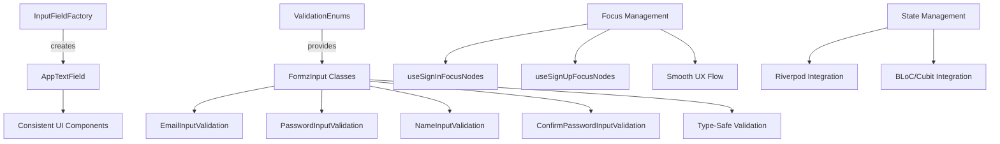

# Form Fields Module Guide

*Last updated: 2025-08-07*

[](https://flutter.dev/)
[](https://dart.dev/)
[](https://pub.dev/packages/formz)


-----------------------------------------------------------------------------------------------
  ## 🌟 Goal
-----------------------------------------------------------------------------------------------

> This module enables **state-agnostic**, **type-safe**, plug-and-play form logic across any feature 
and provides consistent, reusable input fields with:
 - Declarative and reactive validation powered by [Formz]
 - Pure Dart logic with no dependency on any UI state manager
 - Seamless support for both **Riverpod** and **Cubit/BLoC**
 - Localized error feedback via `LocaleKeys`
 - Composable focus node logic for iOS-like UX
 - Semantic UI feedback
 


-----------------------------------------------------------------------------------------------
  ## 🚀 Quick Start
-----------------------------------------------------------------------------------------------

* Integrate module into your poject. No external dependencies on any state management package.
* Centralized `InputFieldFactory.create(...)` builds unified UI across all forms

Supports:
- Field switching
- Password toggle
- Auto-localized labels
- Keyboard types & validation UX
> ✨ Seamless, iOS-native UX.


  ### Basic usage of an email & password field

```dart
Column(
  children: [
    InputFieldFactory.create(
      type: InputFieldType.email,
      focusNode: emailFocusNode,
      errorText: state.email.uiErrorKey,
      onChanged: onEmailChanged,
      onSubmitted: () => passwordFocusNode.requestFocus(),
    ),

    InputFieldFactory.create(
      type: InputFieldType.password,
      focusNode: passwordFocusNode,
      isObscure: state.isPasswordObscure,
      errorText: state.password.uiErrorKey,
      onChanged: onPasswordChanged,
      onSubmitted: onSubmit,
      suffixIcon: ObscureToggleIcon(
        isObscure: state.isPasswordObscure,
        onPressed: togglePasswordVisibility,
      ),
    ),
  ],
);
```

### Use pre-configured focus nodes with hooks (Flutter Hooks)

```dart
final focus = useSignInFocusNodes();

InputFieldFactory.create(
  type: InputFieldType.email,
  focusNode: focus.email,
  onChanged: onEmailChanged,
  onSubmitted: () => focus.password.requestFocus(),
);

InputFieldFactory.create(
  type: InputFieldType.password,
  focusNode: focus.password,
  onChanged: onPasswordChanged,
);
```


-----------------------------------------------------------------------------------------------
## 🧩🔧 State Management Integration
-----------------------------------------------------------------------------------------------

This module is designed to be state-agnostic.
Below are examples of how to use it with Riverpod and Cubit/BLoC-based apps.


### 🔵 Riverpod Integration
Riverpod apps typically use a `FormState` as `StateNotifier` and a `SubmitAction` as an `AsyncNotifier`.

#### Form State Provider
```dart
@riverpod
final class SignInForm extends _$SignInForm {
  @override
  SignInFormState build() => const SignInFormState();
  
  void emailChanged(String value) {
    final email = EmailInputValidation.dirty(value);
    state = state.copyWith(email: email).validate();
  }
  
  void passwordChanged(String value) {
    final password = PasswordInputValidation.dirty(value);
    state = state.copyWith(password: password).validate();
  }
  
  void togglePasswordVisibility() {
    state = state.copyWith(isPasswordObscure: !state.isPasswordObscure);
  }
}
```

#### Form State Model
```dart
final class SignInFormState extends Equatable {
  final EmailInputValidation email;
  final PasswordInputValidation password;
  final bool isPasswordObscure;
  final bool isValid;

  const SignInFormState({
    this.email = const EmailInputValidation.pure(),
    this.password = const PasswordInputValidation.pure(),
    this.isPasswordObscure = true,
    this.isValid = false,
  });

  SignInFormState copyWith({...}) => SignInFormState(...);
  
  SignInFormState validate() {
    final valid = Formz.validate([email, password]);
    return copyWith(isValid: valid);
  }
}
```

#### UI Integration
```dart
final class _EmailField extends ConsumerWidget {
  @override
  Widget build(BuildContext context, WidgetRef ref) {
    final form = ref.watch(signInFormProvider);
    final formNotifier = ref.read(signInFormProvider.notifier);

    return InputFieldFactory.create(
      type: InputFieldType.email,
      focusNode: focusNode,
      errorText: form.email.uiErrorKey,
      onChanged: formNotifier.emailChanged,
    );
  }
}
```


### 🟡 BLoC/Cubit Integration

#### State Definition
```dart
final class SignInPageState extends Equatable {
  final EmailInputValidation email;
  final PasswordInputValidation password;
  final FormzSubmissionStatus status;
  final bool isValid;
  final bool isPasswordObscure;

  const SignInPageState({
    this.email = const EmailInputValidation.pure(),
    this.password = const PasswordInputValidation.pure(),
    this.status = FormzSubmissionStatus.initial,
    this.isValid = false,
    this.isPasswordObscure = true,
  });

  // Validation extension method
  SignInPageState updateWith({
    EmailInputValidation? email,
    PasswordInputValidation? password,
    // ... other fields
  }) {
    final updated = _copyWith(email: email, password: password, ...);
    return updated._copyWith(isValid: Formz.validate([
      email ?? this.email, 
      password ?? this.password
    ]));
  }
}
```

#### Cubit Implementation
```dart
final class SignInCubit extends Cubit<SignInPageState> {
  SignInCubit() : super(const SignInPageState());

  void emailChanged(String value) {
    final email = EmailInputValidation.dirty(value.trim());
    emit(state.updateWith(email: email));
  }

  void passwordChanged(String value) {
    final password = PasswordInputValidation.dirty(value.trim());
    emit(state.updateWith(password: password));
  }

  void togglePasswordVisibility() {
    emit(state.updateWith(isPasswordObscure: !state.isPasswordObscure));
  }
}
```

#### UI Integration
```dart
final class _EmailField extends StatelessWidget {
  @override
  Widget build(BuildContext context) {
    return BlocSelector<SignInCubit, SignInPageState, String?>(
      selector: (state) => state.email.uiErrorKey,
      builder: (context, errorText) {
        return InputFieldFactory.create(
          type: InputFieldType.email,
          focusNode: focusNode,
          errorText: errorText,
          onChanged: context.read<SignInCubit>().emailChanged,
        );
      },
    );
  }
}
```


-----------------------------------------------------------------------------------------------
## 🔍 Advanced Usage / Extending of functionality 
-----------------------------------------------------------------------------------------------

### Custom Validation Rules

```dart
// Extending validation for specific requirements
@override
EmailValidationError? validator(String value) {
  final trimmed = value.trim();
  if (trimmed.isEmpty) return EmailValidationError.empty;
  if (!isEmail(trimmed)) return EmailValidationError.invalid;
  if (trimmed.contains('tempmail')) return EmailValidationError.blocked;
  return null;
}
```


-----------------------------------------------------------------------------------------------
  ## 🧩 Core Elements
-----------------------------------------------------------------------------------------------

The form fields module is built around a small number of core, composable components:


    ### 1. `InputFieldFactory`

Centralized factory that is is the primary entry point for creating strongly-typed, themed and localized form fields. 
> 💡 Use this factory instead of raw `TextField` widgets to ensure unified behavior and accessibility.

   * Available (curently) Field Types:
```dart
enum InputFieldType {
  name,              // 👤 User display name
  email,             // 📧 Email address
  password,          // 🔒 Account password
  confirmPassword,   // 🔁 Confirm password
}
```

   * Behavior:
- Automatically sets correct keyboard type (email, text, etc.)
- Resolves `label` via localization (`LocaleKeys.form_email`, etc.)
- Wraps `AppTextField` with all standard behavior
- Supports suffix icon (e.g. visibility toggle)


---


  ### 2. `AppTextField`

  > 🎨 This widget ensures that all fields follow a uniform visual and behavioral standard across your app, includes:
- Integrated localized label and icon
- Keyboard type handling
- Obscured input (optionally)
- Error rendering via `errorKey.translateOrNull`
- Auto text capitalization based on field type

   * Key Features:
- ✅ `labelText` resolved from localization keys (e.g. `LocaleKeys.form_email`)
- ✅ Prefix icon based on input type (e.g. email, password)
- ✅ Error rendering via `.translateOrNull` from `errorKey`
- ✅ Keyboard type set automatically (`TextInputType.name`, `emailAddress`, etc.)
- ✅ Optional `suffixIcon` (e.g. password toggle)
- ✅ `obscureText` support for secure fields
- ✅ Text capitalization control (e.g. `.words` for names)


* Label localization Logic (with fallback)

```dart
String _resolveLabel(String raw, String? fallback) {
  final isLocalKey = raw.contains('.');
  if (isLocalKey && AppLocalizer.isInitialized) {
    return AppLocalizer.translateSafely(raw, fallback: fallback ?? raw);
  }
  return raw;
}
```


---


  ### 3. `FormzInput<T, E>`-based Validation

  This module uses `FormzInput` subclasses to encapsulate validation logic for each field. Each validator ensures input is both syntactically and semantically correct.

Each input field has a corresponding validator (e.g. `EmailInputValidation`). They expose:
- `.errorKey` — localizable key for error message
- `.uiErrorKey` — returns errorKey only if field is dirty and invalid, used in all widgets to conditionally render error messages without flashing on pure/untouched fields.

This separation makes it easy to:
- Keep logic and UI concerns separate
- Avoid premature error display


  * Available Validators

| Validator Class                  | Input Type       | Rules                                   |
| -------------------------------- | ---------------- | ----------------------------------------|
| `EmailInputValidation`           | Email            | Non-empty, valid email format           |
| `PasswordInputValidation`        | Password         | Non-empty, min 6 characters             |
| `NameInputValidation`            | Full Name        | Non-empty, min 3 characters             |
| `ConfirmPasswordInputValidation` | Confirm Password | Non-empty, must match original password |


  * Each validator extends `FormzInput<String, Enum>` and exposes:
- `isValid` — `true` if value passes validation
- `isPure` — `true` if value was never changed
- `error` — returns the error enum (e.g. `EmailValidationError.invalid`)
- `errorKey` — returns localization key (e.g. `form_email_is_invalid`)
- `uiErrorKey` — returns `errorKey` only if input is dirty and invalid (used by UI)

  * Examples:
```dart
// Creating validation instances
const email = EmailInputValidation.pure();        // Initial state

final email = EmailInputValidation.dirty('user@domain.com');  // With value

// Accessing validation state
email.isValid      // true/false
email.isPure       // true if never modified
email.error        // EmailValidationError enum or null
email.errorKey     // Localization key for error message
email.uiErrorKey   // Returns null if pure/valid, errorKey if invalid
```


  ### 4. `FocusNode` Hooks

This module includes pre-built focus node hooks using `flutter_hooks`. They simplify keyboard navigation and improve UX on forms.

   * Available Hooks
---------------------------------
| Hook Function                   | Returns                                    | Use Case          |
| ------------------------------- | ------------------------------------------ | ----------------- |
| `useSignInFocusNodes()`         | `(email, password)`                        | Sign-in form      |
| `useSignUpFocusNodes()`         | `(name, email, password, confirmPassword)` | Registration form |
| `useChangePasswordFocusNodes()` | `(password, confirmPassword)`              | Change password   |
| `useResetPasswordFocusNodes()`  | `(email)`                                  | Reset password    |

Each hook memoizes the focus nodes and disposes them automatically.

> 🎯 These hooks improve mobile keyboard UX by ensuring intuitive focus field traversal and cleanup.


-----------------------------------------------------------------------------------------------
## 📁 Module Structure
-----------------------------------------------------------------------------------------------

```
form_fields/
│
├── input_validation/
│   ├── validation_enums.dart              # Main file with enums + validation classes
│   ├── email_input.dart                   # EmailInputValidation (part of validation_enums)
│   ├── password_input.dart                # PasswordInputValidation (part of validation_enums)
│   ├── name_input.dart                    # NameInputValidation (part of validation_enums)
│   ├── password_confirm.dart              # ConfirmPasswordInputValidation (part of validation_enums)
│   └── x_on_forms_submission_status.dart  # FormzSubmissionStatus extensions
│
├── widgets/
│   ├── _fields_factory.dart               # InputFieldFactory - main entry point
│   ├── app_text_field.dart                # Base AppTextField component
│   ├── keys_for_widgets.dart              # Centralized widget keys for testing
│   └── password_visibility_icon.dart      # ObscureToggleIcon widget
│
├── utils/
│   ├── use_auth_focus_nodes.dart          # Focus management hooks
│   └── _form_validation_service.dart      # Validation service (if needed)
│
└── README.md                              # This documentation
```


-----------------------------------------------------------------------------------------------
## 🏗️ Architecture Overview
-----------------------------------------------------------------------------------------------




```mermaid
graph TD
    A[InputFieldFactory] --> B[AppTextField]
    B --> C[TextField]
    
    A --> D[FocusNode Hooks]
    D --> E[FocusNode Transitions]

    A --> F[Validation Classes (FormzInput)]
    F --> G[EmailInputValidation]
    F --> H[PasswordInputValidation]
    F --> I[NameInputValidation]
    F --> J[ConfirmPasswordInputValidation]

    F --> K[uiErrorKey]
    K --> L[Localized Error Messages]

    A --> M[ObscureToggleIcon]
    
    %% State managers
    A --> N[Riverpod Integration]
    A --> O[Cubit/BLoC Integration]
    
    N --> P[StateNotifier/FormProvider]
    O --> Q[Cubit/State]

    %% Universal target
    A --> R[Reusable Forms]
    R --> S[Sign In]
    R --> T[Sign Up]
    R --> U[Profile Update]
```

> 🧩 The architecture separates concerns cleanly between field rendering, focus, validation, state, and UX behavior. It enables drop-in integration in any layer without coupling to UI frameworks.


-----------------------------------------------------------------------------------------------
## 🎯 Best Practices
-----------------------------------------------------------------------------------------------

### ✅ Do

- **Use InputFieldFactory**: Always create fields through the factory for consistency
- **Leverage Focus Hooks**: Use provided hooks for automatic focus management
- **Properly uiErrorKey using**: Display errors only when field is dirty and invalid
- **Validate on Change**: Update validation state immediately on user input
- **Use Proper Keys**: Assign test keys for reliable automated testing
- **Handle formfield visibility** with `ObscureToggleIcon`
- Test all validators and state logic independently
- Use `BlocSelector` or `ref.watch(selector)`. Scope widget rebuilds only to the fields that changed.
- **Debounce Input**: Avoid excessive validation on rapid typing
- **Memoize Focus Nodes**: Use hooks to prevent recreation on rebuilds
- **Selective Updates**: Only update changed fields, not entire form state
- **Use provided aliases**, that located at `extensions/formz_status_x.dart` (`isLoading`, `isIdle`, `isValidated`, `canSubmit`)


  Examples:
```dart
// ✅ Optimized - Only rebuilds when email error changes
BlocSelector<SignInCubit, SignInPageState, String?>(
  selector: (state) => state.email.uiErrorKey,
  builder: (context, errorText) => InputFieldFactory.create(...),
)

// ✅ Optimized - Debounced validation updates
final _debouncer = Debouncer(Duration(milliseconds: 300));
void emailChanged(String value) {
  _debouncer.run(() {
    final email = EmailInputValidation.dirty(value.trim());
    emit(state.updateWith(email: email));
  });
}
```


### ❌ Don't

- **Don't Create Fields Directly**: Bypass the factory pattern (Write raw `TextField` widgets)
- **Don't Show Errors Prematurely**: Display validation errors on pure fields  
- **Don't Ignore Focus Flow**: Leave users stranded without proper navigation
- **Don't Hardcode Strings**: Use localization keys for all user-facing text
- **Manually manage focus nodes in every screen**


-----------------------------------------------------------------------------------------------
## 🔧 Troubleshooting
-----------------------------------------------------------------------------------------------
### Common Issues

**❓ Fields not showing error message**
- Ensure you're using `uiErrorKey` instead of `errorKey`
- Check that field is in `dirty` state, not `pure`
- Ensure `onChanged` is wired correctly to update state

**❓ Focus doesn't change on submit?**
- Verify you're using the provided focus node hooks
- Check `onSubmitted` callbacks are calling `requestFocus()`

**❓ Form validation not updating**
- Make sure to call `.validate()` after field updates
- Check that state is properly immutable and triggers rebuilds

**❓ Password visibility toggle not working**
- Verify `isObscure` parameter is bound to state and stored in state
- Check that `onPressed` callback updates the obscure flag
- Attach `ObscureToggleIcon` to `suffixIcon`

### ❓ Labels or error texts not translated?
- Ensure localization keys (e.g. `form_email_is_invalid`) exist
- Call `AppLocalizer.initialize()` early in your app


### Debug Checkers

```dart
// Enable debug logging for form validation
void debugFormState(FormState state) {
  debugPrint('📧 Email: ${state.email.value} (valid: ${state.email.isValid})');
  debugPrint('🔒 Password: ${state.password.value} (valid: ${state.password.isValid})');
  debugPrint('✅ Form valid: ${state.isValid}');
}
```


-----------------------------------------------------------------------------------------------
## 🧭 Summary
-----------------------------------------------------------------------------------------------

The `form_fields` module provides a scalable, reusable, and consistent foundation for building forms in Flutter apps.

✅ Unified form UX across all features  
✅ Works with both Riverpod and Cubit/BLoC out of the box  
✅ Declarative validation powered by `Formz`  
✅ Localized errors and accessibility built-in  
✅ Fully testable and clean-architecture compliant
✅ Unified form UX across all features
✅ Works with both Riverpod and Cubit/BLoC out of the box
✅ Declarative validation powered by `Formz`
✅ Localized errors and accessibility built-in
✅ Fully testable and clean-architecture compliant
- 🏗️ **Clean Architecture**: Proper separation of concerns across layers
- 🔒 **Type Safety**: Compile-time validation error detection  
- 🎨 **Consistent UI**: Unified design system for all form inputs
- 🚀 **Developer Experience**: Minimal boilerplate with maximum flexibility
- ⚡ **Performance**: Optimized rebuilds and validation cycles
- 🧪 **Testability**: Easy unit, widget, and integration testing


### **BENEFITS**:

* 🎨 Consistent UI
- **Unified Design**: All fields share the same visual styling
- **Accessibility**: Built-in support for screen readers and keyboard navigation
- **Responsive**: Adapts to different screen sizes and orientations

* 🔒 Type-Safe Validation
- **Compile-time Safety**: Validation errors caught at build time
- **Formz Integration**: Leverages proven validation patterns
- **Localization Ready**: Error messages use translation keys

* 🚀 Developer Experience  
- **Minimal Boilerplate**: Factory pattern reduces repetitive code
- **Clear APIs**: Intuitive method names and parameters
- **Testing Support**: Centralized keys and predictable behavior

* 🔄 State Management Agnostic
- **Riverpod Support**: Optimized providers and state classes
- **BLoC/Cubit Support**: Clean integration with bloc pattern
- **Pure Dart**: Core validation works without any state management


> 🧠 Whether you're building auth, profile, onboarding, or settings forms — this module simplifies your codebase and improves maintainability.

Start integrating it today and write forms that feel native, robust, and easy to scale.
